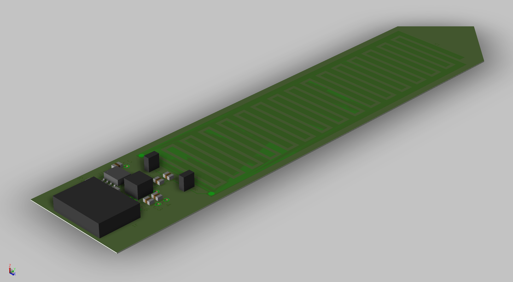

# SoilSensor
Sensor node to measure soil moisture and temperature, communicating to a LoRa network for IoT.

## Schematic
The circuit was designed using *Cadence Capture* software.

## PCB Layout
On [soilsensor.pdf](PCB/soilsensor.pdf) you can find a interactive 3d pdf with the definitive design layout. All components showed are listed on the [BOM list](PCB/SoilSensorBOM.xlsx), you can find also some datasheet on folder *Datasheets*. All gerber files necessary to produce the final board are on *PCB/Artwork/* : they are divided by layers.

